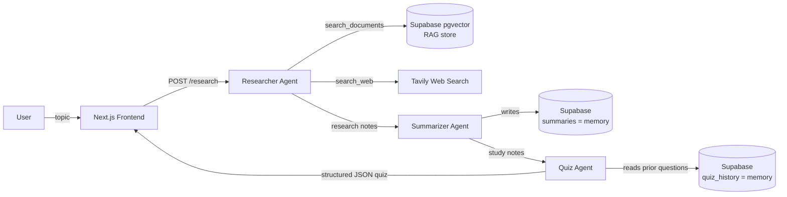

# AI Study Agent

A multi-agent study assistant: a **Researcher** agent (RAG + web search), a
**Summarizer** agent, and a **Quiz** agent that work together to turn a topic
into study notes and a practice quiz.

> Status: feature-complete (Phases 0-6). See roadmap below.

## Architecture



Each agent is a separate Python module (`researcher.py`, `summarizer.py`,
`quiz.py`) orchestrated by Flask (`app.py`). The Researcher is the only
agent that makes autonomous tool-use decisions; the Summarizer and Quiz
agents are single-prompt steps that read/write the two Supabase tables
acting as persistent memory across sessions.

## Setup

### 1. Supabase
1. Create a project at https://supabase.com
2. Go to **SQL Editor** and run `backend/schema.sql`
3. Copy your Project URL and `service_role` key from **Settings -> API**

### 2. Backend (Flask)
```bash
cd backend
python -m venv venv
source venv/bin/activate    # Windows: venv\Scripts\activate
pip install -r requirements.txt
cp .env.example .env         # then fill in your Supabase + Anthropic + Tavily keys
python app.py
```
Visit http://localhost:5000/health - you should see a JSON status confirming
which keys are configured.

> **Note on cost:** embeddings run locally via `sentence-transformers`
> (no API key, no cost, works offline after the first model download).
> The agents (Phase 2+) use Google Gemini via AI Studio, which has a real
> permanent free tier (unlike Anthropic/OpenAI, which only give one-time
> trial credits) - so the whole project can run at $0.

### 3. Frontend (Next.js)
```bash
cd frontend
npm install
cp .env.local.example .env.local
npm run dev
```
Visit http://localhost:3000 and click "Check backend health" to confirm the
frontend and backend are connected.

### 4. Ingest documents (Phase 1)
Drop `.txt` or `.pdf` files into `backend/sample_docs/` (a sample file is
already included), then run:
```bash
cd backend
python ingest.py --topic "operating-systems"
```
Test retrieval directly:
```
GET http://localhost:5000/retrieve?q=What is Round Robin scheduling?
```
Or run the quick retrieval accuracy check:
```bash
python eval_retrieval.py
```

### 5. Run the Researcher agent (Phase 2)
You'll need two more keys in `backend/.env`:
- `GEMINI_API_KEY` - free, no credit card required, at https://aistudio.google.com/app/apikey
- `TAVILY_API_KEY` - free tier at https://tavily.com (used for the agent's web search tool)

Test it directly from the command line:
```bash
cd backend
python researcher.py "What is Round Robin scheduling?"
```
This prints the research notes plus a log of which tools Gemini decided to
call (`search_documents`, `search_web`, or both) - this tool-selection
transparency is exactly what makes it an *agent* rather than a plain
RAG pipeline.

Or via the API:
```
POST http://localhost:5000/research
Body: { "topic": "Round Robin scheduling" }
```

### 6. Run the Summarizer agent (Phase 3)
No new keys needed - reuses `GEMINI_API_KEY`. This chains Researcher output
into clean, structured notes and saves them to the `summaries` table in
Supabase (this is the system's long-term "memory" of covered topics).

Test the full Researcher -> Summarizer chain from the command line:
```bash
cd backend
python summarizer.py "Round Robin scheduling"
```

Or run the whole pipeline built so far via the API:
```
POST http://localhost:5000/study-session
Body: { "topic": "Round Robin scheduling" }
```
This returns research notes, the tool-call log, and the structured summary
in one response (quiz will be added in Phase 4).

### 7. Run the Quiz agent (Phase 4)
No new keys needed - reuses `GEMINI_API_KEY`. This generates multiple-choice
questions from a summary using **structured output** (a forced JSON schema,
not free-form text parsing), and checks `quiz_history` in Supabase first so
it doesn't repeat questions already asked on the same topic.

Test the full Researcher -> Summarizer -> Quiz chain from the command line:
```bash
cd backend
python quiz.py "Round Robin scheduling"
```

Or run the complete pipeline via the API:
```
POST http://localhost:5000/study-session
Body: { "topic": "Round Robin scheduling" }
```
This now returns research notes, tool-call log, structured summary, and a
ready-to-use quiz - the full agent pipeline in a single call.

To test the "memory" behavior, run the same topic twice and confirm the
second run's questions are different from the first (check `quiz_history`
in Supabase to see all stored questions for a topic).

### 8. Use the frontend (Phase 5)
With the backend running (`python app.py`) and frontend running (`npm run dev`),
open http://localhost:3000, type a topic, and click **Run**. You'll see:
- A live pipeline rail showing which agent is currently working
- Which tool(s) the Researcher used (📄 your docs / 🌐 the web) once it finishes
- Collapsible raw research notes
- Formatted study notes
- An interactive quiz - click an option to see it marked right/wrong with an explanation, and a running score

Try the example topic chips first to confirm everything's wired up before typing your own.

## Roadmap

- [x] Phase 0: Project scaffold
- [x] Phase 1: RAG foundation - ingest docs, embed, retrieve from Supabase pgvector
- [x] Phase 2: Researcher agent - RAG + web search tool use
- [x] Phase 3: Summarizer agent - structured notes, stored as "memory"
- [x] Phase 4: Quiz agent - structured JSON quiz output, avoids repeat questions
- [x] Phase 5: Frontend - pipeline progress UI + interactive quiz
- [x] Phase 6: Polish - README diagram, eval script, deployment

## Retrieval quality

`backend/eval_retrieval.py` runs 5 test questions against the ingested
documents and reports what fraction were answered by a genuinely relevant
chunk. Run it yourself and drop your result here:

```bash
cd backend
python eval_retrieval.py
```

> **Result:** _run the command above and paste your score here, e.g.
> "5/5 (100%) on the sample Operating Systems document set" - a concrete
> number here is worth more on a resume than the claim alone._

## Screenshots

_Add 1-2 screenshots or a short GIF of the running app here before sharing
this repo - e.g. the pipeline rail mid-run, and a completed quiz card._
``

## Deployment

Once everything works locally, deploy it so you have a live demo link
(not just code) to put on your resume.

### Backend -> Render
1. Push this repo to GitHub if you haven't already
2. Go to https://dashboard.render.com -> New -> Blueprint, and point it at
   your repo (it reads `render.yaml` at the project root automatically)
3. Add your real values for the env vars Render prompts for
   (`SUPABASE_URL`, `SUPABASE_SERVICE_ROLE_KEY`, `GEMINI_API_KEY`,
   `TAVILY_API_KEY`) - leave `FRONTEND_URL` for now, you'll set it after
   deploying the frontend
4. Deploy - Render gives you a URL like `https://ai-study-agent-backend.onrender.com`

> Free-tier note: Render's free web services spin down after inactivity
> and take ~30-60s to wake on the next request - normal for a demo project,
> just don't be surprised by the first request being slow.

### Frontend -> Vercel
1. Go to https://vercel.com -> New Project -> import this repo
2. Set the **root directory** to `frontend` in the import settings
3. Add an environment variable: `NEXT_PUBLIC_BACKEND_URL` = your Render
   backend URL from above
4. Deploy - Vercel gives you a URL like `https://ai-study-agent.vercel.app`

### Final step: lock down CORS
Go back to Render -> your backend service -> Environment, and set
`FRONTEND_URL` to your actual Vercel URL, then redeploy the backend. This
ensures only your deployed frontend (not just anyone) can call your API.

## Tech stack

- Backend: Flask, Google Gemini API (agents), sentence-transformers (free local embeddings)
- Vector DB: Supabase (pgvector, 384-dim vectors)
- Frontend: Next.js (App Router), React
- Web search: Tavily API
